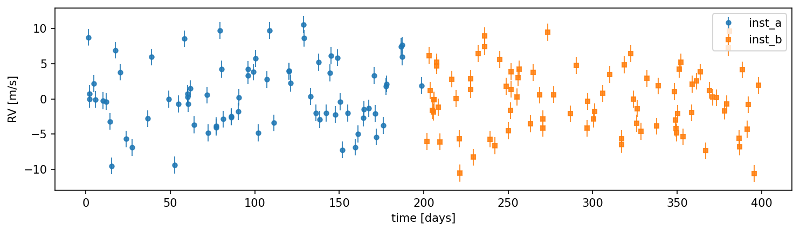
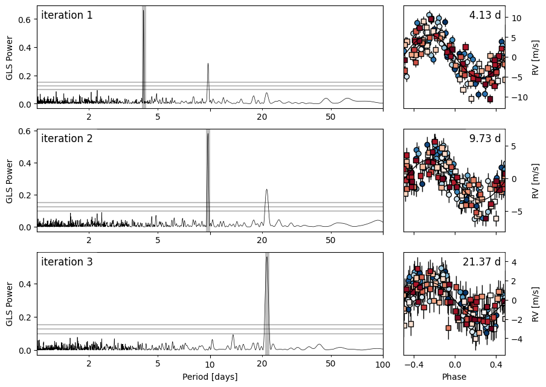
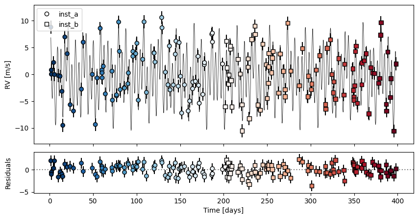

# freq

Frequency analysis of unevenly sampled radial-velocity time series: iterative GLS
(Zechmeister & Kürster 2009) and the \(\ell_1\) periodogram (Hara et al. 2017,
MNRAS 464, 1220).

Here is a radial-velocity time series with two instruments and a few planets hidden in
the scatter:



freq recovers the periodic signals:



and the fitted model leaves clean residuals:



## Install

```bash
pip install git+https://github.com/john-livingston/freq
```

## Quick start

Python:

```python
from freq import iterative_gls, l1_periodogram

# t, rv, rv_err, inst are numpy arrays (inst is a per-point instrument label)
gls = iterative_gls(t, rv, rv_err, inst_rv=inst, n=3, pmin=1, pmax=100)
l1  = l1_periodogram(t, rv, rv_err, inst_rv=inst, sigmaW=1.0)
```

Command line (default mode is the GLS stack; `--l1` switches to the \(\ell_1\)
periodogram):

```bash
freq rvs.csv -c bjd rv rv_err inst_name --sep ',' -n 3 --pmin 1 --pmax 100 -o results
freq rvs.csv -c bjd rv rv_err inst_name --sep ',' --l1 --pmin 1 --pmax 100 -o results
```

## What it does

freq finds periodic signals in radial-velocity time series. The iterative GLS gives
a fast quick-look by prewhitening one sinusoid at a time; the \(\ell_1\) periodogram
fits all signals at once under a noise-covariance model, producing far fewer
aliases. See the [Guide](usage.md) for the full workflow, the
[Noise model](noise-model.md) for the covariance and cross-validation, the
[CLI reference](cli.md) for every flag, and the [API reference](api.md) for the
Python functions.
