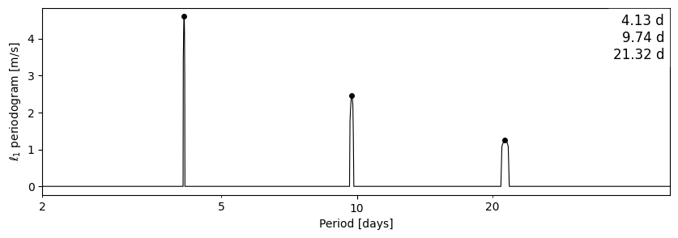
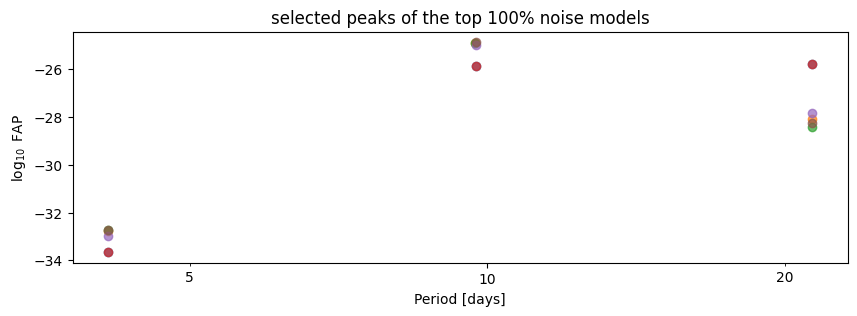

# Guide

This walkthrough uses a synthetic two-instrument data set with three injected
planets (see `scripts/gen_docs_figures.py`). Substitute your own arrays.

## Iterative GLS

`iterative_gls` computes a generalized Lomb–Scargle periodogram, subtracts the best
sinusoid, and repeats `n` times. Per-instrument median velocities are subtracted
automatically (GLS has no offset model). The result dict carries the fitted data,
the per-iteration summary, and the figure.

```python
from freq import iterative_gls, plot_gls_timeseries

res = iterative_gls(t, rv, rv_err, inst_rv=inst, n=3, pmin=1, pmax=100)
plot_gls_timeseries(res)          # residual + model time series
for s in res['summary']:
    print(s['P'], s['FAP'])
```


`plot_gls_timeseries` shows the summed model over the data and the residuals:


## ℓ₁ periodogram

`l1_periodogram` fits all signals simultaneously via basis pursuit under a noise
covariance. Instrument offsets are modelled as unpenalized vectors, so no manual
zero-point subtraction is needed. See the [Noise model](noise-model.md) for the
covariance parameters.

```python
from freq import l1_periodogram

l1 = l1_periodogram(t, rv, rv_err, inst_rv=inst, pmin=2, pmax=50, sigmaW=1.0)
print(l1['table'])                # peaks with periods, amplitudes, FAP, aliases
```



## Choosing a noise model by cross-validation

`l1_crossval` ranks a grid of noise models by held-out log-likelihood (Hara et al.
2020) and reruns the \(\ell_1\) periodogram with the best one. The peak-stability
plot shows which peaks survive across the top-ranked models — trust the ones that
appear regardless of the assumed noise.

```python
from freq import l1_crossval

cv = l1_crossval(t, rv, rv_err, inst_rv=inst, pmin=2,
                 sigmaW=(0.5, 1, 2), sigmaR=(0, 2, 4), tau=(41, 82), Prot=(-1, 30))
print(cv['best'])                 # winning (sigmaW, sigmaR, tau, Prot)
```



## Activity indicators

With `-ai`, the CLI computes a per-instrument GLS of each named activity-indicator
column, so you can check whether a periodic RV signal also appears in a stellar
activity tracer (rotation and its harmonics).

```bash
freq rvs.csv -c bjd rv rv_err inst_name --sep ',' -ai shk halpha bis fwhm -o results
```

The best period of each indicator is printed per instrument, and the periodograms
are written to `activity_indicators-<inst>.png`:

```
harps shk: 24.4 d (FAP 1.60e-68)
harps halpha: 24.4 d (FAP 1.39e-63)
harpsn shk: 24.5 d (FAP 2.42e-75)
harpsn halpha: 24.5 d (FAP 5.34e-67)
```

If an indicator has a matching `<name>_err` column it is used as the uncertainty,
otherwise the GLS runs unweighted. Rows where the indicator is missing are dropped,
and an indicator is skipped entirely (with a note) when the named column does not
exist or is identically zero for that instrument.

!!! tip "Interpreting the result"
    A period that appears in both the RVs and a chromospheric or line-shape
    indicator is stellar activity, not a planet. Note that activity signals are
    not coherent over long baselines — spots evolve — so per-instrument (roughly
    per-epoch) periodograms are often *more* sensitive to them than one
    periodogram of the pooled time series.
